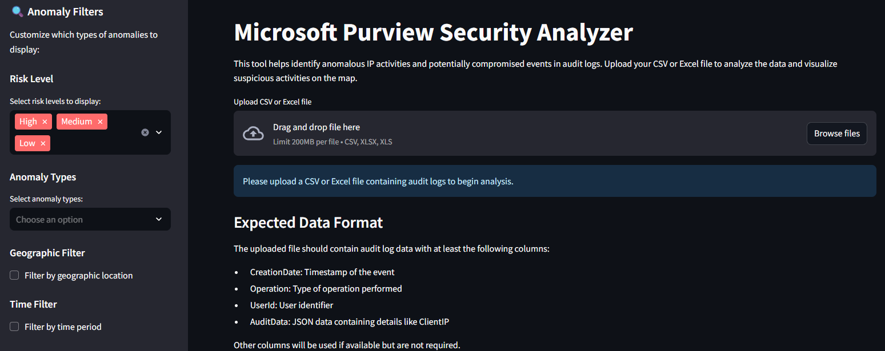
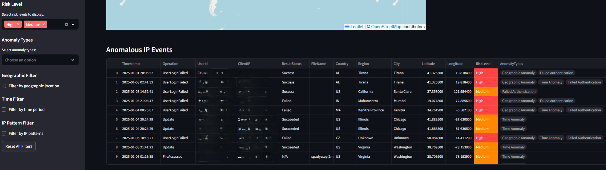
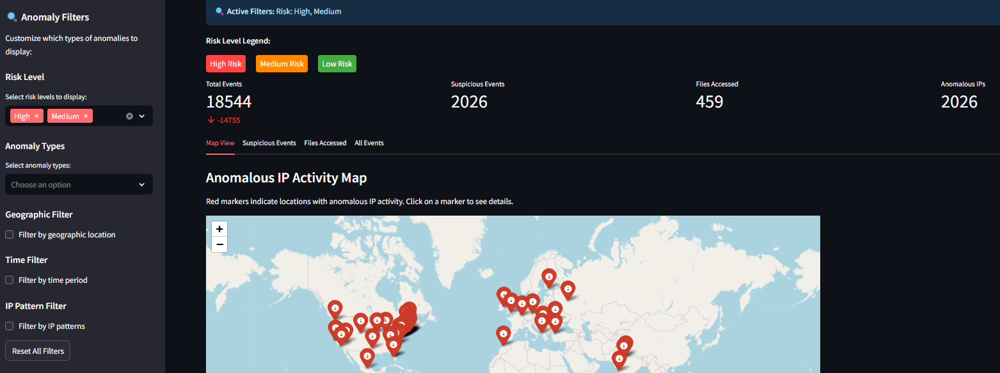

# Overview

The Microsoft Purview Security Analyzer is a web-based security analysis tool built with Streamlit that processes audit log files (CSV/Excel) to identify anomalous IP activities and potential security breaches. The application provides interactive geospatial mapping capabilities to visualize suspicious activities on a world map, helping security analysts identify potentially compromised events and unusual access patterns.

# User Preferences

Preferred communication style: Simple, everyday language.

# System Architecture

## Frontend Architecture
- **Framework**: Streamlit-based web application providing an interactive dashboard
- **File Upload System**: Supports CSV and Excel file uploads for audit log processing
- **Interactive Visualizations**: 
  - Folium-based interactive maps for geospatial visualization
  - Data tables for detailed analysis with color-coded risk levels
  - Export functionality for analysis results in JSON format
- **Session State Management**: Maintains processed data between re-renders to improve performance
- **Advanced Filtering System**: Comprehensive sidebar filters including:
  - Risk level filtering (High/Medium/Low)
  - Anomaly type classification and filtering
  - Geographic location exclusion filters
  - Time-based filtering (business hours, weekends, custom ranges)
  - IP pattern analysis (first-time, frequent, cross-country IPs)

## Backend Architecture
- **Core Processing Engine**: Modular Python architecture with separate components:
  - `security_analyzer.py`: Main analysis logic for detecting compromised events and anomalous IPs
  - `processor.py`: File parsing and data processing utilities
  - `utils/`: Utility modules for file processing, IP analysis, and map generation
- **Data Processing Pipeline**:
  - Audit log parsing from CSV/Excel files
  - JSON data extraction from AuditData fields
  - Timeline creation with geolocation enrichment
  - Anomaly detection algorithms for IP activity analysis

## Data Storage Solutions
- **File-based Processing**: No persistent database; processes uploaded files in memory
- **Temporary File Handling**: Uses Python's tempfile module for secure file processing
- **Session State**: Streamlit session state for maintaining processed data during user sessions

## Geolocation Services
- **GeoIP Database**: Integrates MaxMind's GeoLite2-City.mmdb database for IP geolocation
- **IP Analysis**: 
  - Private IP detection and filtering
  - Known IP registry for common addresses
  - Geolocation enrichment for public IP addresses

## Security Features
- **Anomaly Detection**: Identifies potentially compromised events based on IP activity patterns
- **Risk Assessment**: Advanced multi-factor risk scoring system that evaluates:
  - Geographic risk (country-based threat assessment)
  - Operation risk (suspicious activities like deletions, failed logins)
  - Temporal risk (outside business hours, weekend activity)
  - Combined risk scoring with High/Medium/Low classifications
- **Custom Filtering**: Users can focus on specific types of threats and anomalies
- **Visual Risk Indicators**: Color-coded data tables showing risk levels at a glance
- **Data Privacy**: Local processing without external API calls for sensitive audit data

# External Dependencies

## Core Libraries
- **Streamlit**: Web application framework for the user interface
- **Pandas**: Data manipulation and analysis for processing audit logs
- **Folium**: Interactive mapping library for geospatial visualizations
- **streamlit-folium**: Integration between Streamlit and Folium maps

## Geolocation Services
- **GeoIP2**: MaxMind's Python library for IP geolocation lookups
- **GeoLite2-City.mmdb**: MaxMind's geolocation database (included in repository)

## File Processing
- **OpenPyXL**: Excel file reading and processing capabilities
- **Trafilatura**: Text extraction and processing utilities

## Deployment Platforms
- **Streamlit Cloud**: Recommended deployment platform for easy hosting
- **Heroku**: Alternative cloud deployment option
- **Local Development**: Standard Python environment with pip dependencies

## Development Tools
- **Git**: Version control system
- **Python 3.8+**: Minimum runtime requirement
- **Virtual Environment**: Recommended for dependency isolation